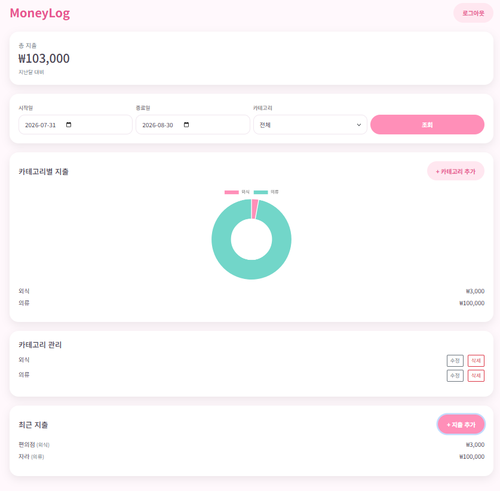
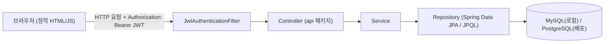
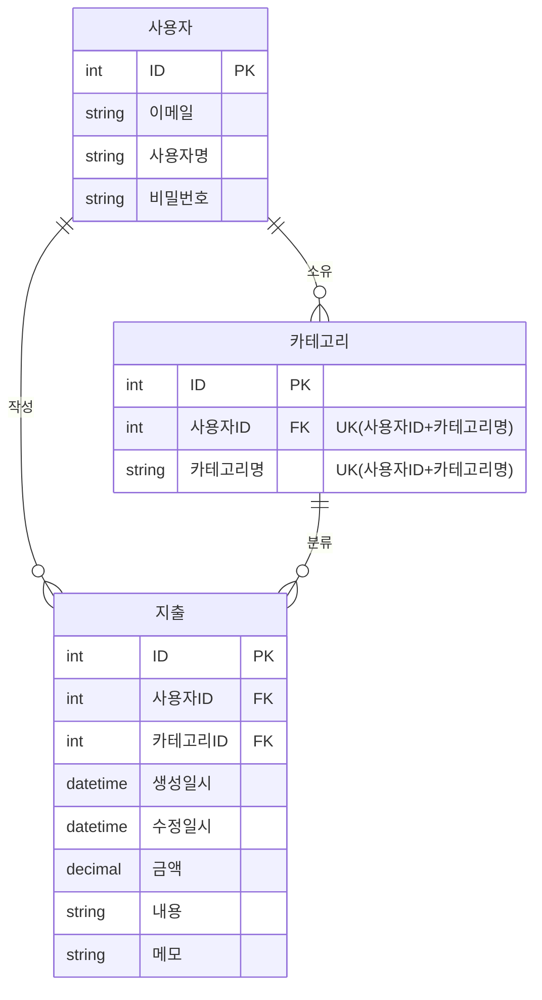

# 📊 MoneyLog


> 지출을 기록하고, 숫자로 이해하는 가계부 웹앱

<!-- 📸 스크린샷 자리: 대시보드(도넛 차트 + 전월 대비 증감률) -->
<p align="center">
  
</p>

<!-- 📸 스크린샷 자리: 지출 목록/필터링 화면 -->
<p align="center">
  
</p>

<!-- TODO: 배포 데모 링크 추가 (배포 시) -->
<!-- TODO: 개발 기간 추가 (예: 2026.MM ~ 2026.MM, N주) -->

---

## 목차

- [프로젝트 소개](#프로젝트-소개)
- [주요 기능](#주요-기능)
- [기술 스택](#기술-스택)
- [시스템 아키텍처](#시스템-아키텍처)
- [핵심 구현](#핵심-구현)
- [개발 과정에서의 개선 & 트러블슈팅](#개발-과정에서의-개선--트러블슈팅)
- [실행 방법](#실행-방법)
- [API 문서](#api-문서)
- [ERD](#erd)
- [프로젝트 구조](#프로젝트-구조)

---

## 프로젝트 소개

지출 내역을 단순히 기록하는 데 그치지 않고, **집계 쿼리 기반의 월별/카테고리별 통계**로 소비 패턴을 파악할 수 있게 해주는 가계부 웹앱입니다.

- 회원가입부터 로그인, 지출/카테고리 관리, 통계 대시보드까지 백엔드 API와 프론트엔드를 직접 설계·구현했습니다.
- 개인 프로젝트로, 인증/보안 구조와 통계 집계 쿼리 설계에 특히 신경을 썼습니다.

<!-- TODO: 프로젝트를 시작한 계기(동기)를 1~2문장 추가하면 더 좋습니다.
예) "매달 어디에 돈이 새는지 감으로만 파악하던 문제를 데이터로 확인하고 싶어서 시작했습니다." -->

---

## 주요 기능

사용자 시나리오 순서로 정리했습니다.

1. **회원가입 / 로그인** — 이메일·비밀번호로 가입하고 로그인 시 JWT를 발급받습니다.
2. **로그인 보호** — 5회 연속 로그인 실패 시 15분간 계정이 잠깁니다.
3. **카테고리 관리** — 지출을 분류할 카테고리를 생성·조회·수정·삭제합니다. (지출이 남아있는 카테고리는 삭제할 수 없습니다.)
4. **지출 관리** — 지출 내역을 등록·조회·수정·삭제하며, 카테고리/기간으로 필터링해 조회할 수 있습니다.
5. **통계 대시보드** — 기간 내 총 지출, 카테고리별 지출 비중(도넛 차트), 전월 대비 증감률을 확인합니다.
6. **회원 정보 관리** — 사용자명/비밀번호 변경, 회원 탈퇴(연관 데이터 함께 삭제)를 지원합니다.

---

## 기술 스택

| 스택 | 사용 목적 |
|---|---|
| Java 21 | 백엔드 로직 구현 |
| Spring Boot 4.1.0 (Web MVC) | REST API 서버 |
| Spring Data JPA / Hibernate | 엔티티 매핑 및 JPQL 기반 통계 집계 쿼리 작성 |
| MySQL 8.0 | 로컬 개발 환경 데이터베이스 |
| PostgreSQL | 배포 환경 데이터베이스 |
| Spring Security + JWT (jjwt) | Stateless 인증, 로그인 시도 제한 기반 계정 보호 |
| Springdoc OpenAPI (Swagger UI) | API 명세 자동 생성 |
| Gradle | 빌드 및 의존성 관리 |
| HTML / CSS / JavaScript (Vanilla) | 별도 프레임워크 없이 구현한 프론트엔드 |

---

## 시스템 아키텍처



- 인증이 필요한 요청은 `JwtAuthenticationFilter`에서 토큰을 검증한 뒤 `userId`를 `SecurityContext`에 저장하고, 컨트롤러는 `@AuthenticationPrincipal`로 이를 주입받습니다.
- 인증되지 않은 요청은 `401 Unauthorized`로 즉시 차단됩니다.

---

## 핵심 구현

### JWT 인증 필터 직접 구현
`JwtTokenProvider`가 로그인 성공 시 토큰을 발급하고, `JwtAuthenticationFilter`(`OncePerRequestFilter`)가 매 요청마다 `Authorization` 헤더를 검증해 인증 정보를 등록합니다. 컨트롤러는 `@AuthenticationPrincipal Long userId`로 인증된 사용자 ID를 바로 주입받습니다.

### 로그인 시도 제한 (계정 잠금)
`LoginAttemptService`가 이메일 기준 로그인 실패 횟수를 관리하여 5회 실패 시 15분간 계정을 잠급니다. 잠긴 상태에서 로그인을 시도하면 `AccountLockedException`이 발생하고 `423 Locked` 응답을 반환합니다.

### 예외 처리 구조 통일
카테고리/지출/사용자 도메인별로 `NotFound`, `AccessDenied`, `Duplicate` 등 예외를 세분화해 정의하고, `GlobalExceptionHandler`(`@RestControllerAdvice`)에서 이를 일관된 에러 응답 포맷(`ErrorResponseDto`)과 HTTP 상태 코드로 매핑합니다.

### JPQL 기반 통계 집계
`ExpenseRepository`의 JPQL 쿼리로 기간별 총 지출 합계와 카테고리별 합계(DTO Projection)를 계산합니다. 전월 대비 증감률은 이번 달/지난 달 통계를 각각 조회한 뒤 프론트엔드(`dashboard.js`)에서 계산합니다.

---

## 개발 과정에서의 개선 & 트러블슈팅

### DTO 클래스 구조 리팩토링
- **문제**: 도메인(카테고리, 지출, 사용자)별로 요청/응답 DTO를 개별 파일로 분리하다 보니 파일 수가 빠르게 늘어나 `dto` 패키지 관리가 어려워졌습니다.
- **개선**: 도메인별로 관련된 DTO들을 하나의 클래스 안에 **중첩 정적 클래스(nested static class)** 형태로 통합했습니다. 예를 들어 `ExpenseDto` 클래스 안에 `CreateRequest`, `UpdateRequest`, `Response` 등을 정적 내부 클래스로 묶는 방식입니다.
- **효과**: DTO 파일 수를 **15개 → 8개**로 약 47% 줄였고, 관련 DTO들이 도메인 단위 클래스 하나에 모이면서 코드를 찾고 수정하기가 훨씬 쉬워졌습니다.

### AI 서브에이전트를 활용한 QA 프로세스
- 기능 구현 이후 **QA 전용 서브에이전트**를 별도로 구성해 기능 구현 로직과 분리된 관점에서 테스트/검증 작업을 진행했습니다.
- 자체 검증만으로는 놓치기 쉬운 문제를 더 일찍 발견할 수 있었습니다.

**실제로 발견된 케이스**

- **회원 탈퇴 실패**: 카테고리와 지출 데이터가 모두 존재하는 계정에서 회원 탈퇴(계정 삭제)를 시도하면 실패하는 문제를 발견했습니다. 연관 엔티티(카테고리 → 지출) 삭제 순서 문제로, 삭제 로직의 처리 순서를 재정리해 해결했습니다.
- **토큰 미삭제 버그**: `clearToken()` 메서드 내 오타로 인해 로그아웃/세션 만료/회원 탈퇴 시점에 토큰이 실제로는 삭제되지 않는 문제를 발견했습니다. 정상 동작처럼 보였지만 만료된 토큰이 계속 유효한 상태로 남아있던 보안상 중요한 이슈였고, 구현 코드만으로는 놓치기 쉬웠던 부분을 QA 서브에이전트가 별도 검증 과정에서 잡아냈습니다.

---

## 실행 방법

### 사전 준비
- JDK 21
- MySQL 8.x (로컬 실행 시)

### 1. 데이터베이스 준비
```sql
CREATE DATABASE moneylog;
```

### 2. 시크릿 설정 파일 생성
`application-secret.properties`는 git에 포함되지 않으므로 직접 생성해야 합니다.

```
# MoneyLog/src/main/resources/application-secret.properties
jwt.secret=<32바이트 이상의 임의 문자열>
```

### 3. 애플리케이션 실행
```bash
# macOS / Linux
./gradlew bootRun --args='--spring.profiles.active=dev'

# Windows
gradlew.bat bootRun --args="--spring.profiles.active=dev"
```

기본 접속 주소: `http://localhost:8080`

> 배포(prod) 환경은 PostgreSQL과 `DATABASE_URL`, `DATABASE_USERNAME`, `DATABASE_PASSWORD` 환경 변수를 사용하며, Swagger UI는 비활성화됩니다. (`application-prod.properties`)

---

## API 문서

애플리케이션 실행 후 Swagger UI에서 전체 API 명세를 확인할 수 있습니다. (dev 프로필 기준)

```
http://localhost:8080/swagger-ui.html
```

### 대표 엔드포인트

| Method | 경로 | 설명 | 인증 |
|---|---|---|---|
| POST | `/api/users/signup` | 회원가입 | X |
| POST | `/api/users/login` | 로그인 (JWT 발급) | X |
| POST | `/api/categories` | 카테고리 생성 | O |
| GET | `/api/categories` | 카테고리 목록 조회 | O |
| POST | `/api/expenses` | 지출 등록 | O |
| GET | `/api/expenses` | 지출 목록 조회 (카테고리/기간 필터) | O |
| GET | `/api/expenses/summary` | 기간별 총 지출 + 카테고리별 합계 | O |

### 예시: 로그인

**Request**
```
POST /api/users/login
```
```json
{
  "email": "user@example.com",
  "password": "password123!"
}
```

**Response**
```json
{
  "token": "eyJhbGciOiJIUzI1NiJ9...",
  "userId": 1,
  "expiresIn": 3600000
}
```

이후 요청에는 `Authorization: Bearer <token>` 헤더를 포함합니다.

### 예시: 카테고리 생성

**Request**
```
POST /api/categories
```
```json
{
  "categoryName": "식비"
}
```

**Response**
```json
{
  "categoryId": 3,
  "categoryName": "식비"
}
```

### 예시: 통계 조회

```
GET /api/expenses/summary?startDate=2026-08-01&endDate=2026-08-31
```

```json
{
  "totalAmount": 152000,
  "categorySummaryList": [
    { "categoryName": "식비", "totalAmount": 80000 },
    { "categoryName": "교통", "totalAmount": 72000 }
  ]
}
```

---

## ERD



---

## 프로젝트 구조

```
MoneyLog
└── src
    ├── main
    │   ├── java/com/MoneyLog
    │   │   ├── MoneyLogApplication.java   # 진입점, JPA Auditing 활성화
    │   │   ├── api/                       # REST 컨트롤러 (Auth, User, Category, Expense)
    │   │   ├── service/                   # 비즈니스 로직 (로그인 시도 제한 포함)
    │   │   ├── repository/                # Spring Data JPA + JPQL 집계 쿼리
    │   │   ├── model/                     # JPA 엔티티 (User, Category, Expense)
    │   │   ├── dto/                       # 도메인별로 통합된 요청/응답 DTO (중첩 정적 클래스)
    │   │   ├── security/                  # JWT 발급/검증, 인증 필터
    │   │   ├── config/                    # Security, Swagger, Web 설정
    │   │   ├── exception/                 # 커스텀 예외 + GlobalExceptionHandler
    │   │   └── enums/                     # Role 등 열거형
    │   └── resources
    │       ├── static/                    # 프론트엔드 (HTML/CSS/JS)
    │       └── application*.properties    # 환경별 설정 (default/dev/prod/secret)
    └── test/java/com/MoneyLog             # 통합 테스트 (MockMvc 기반)
```